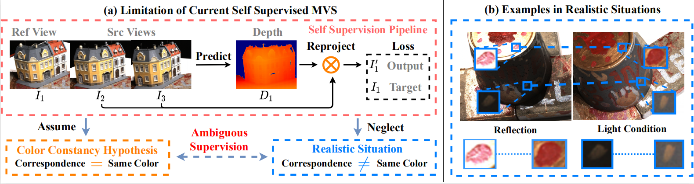
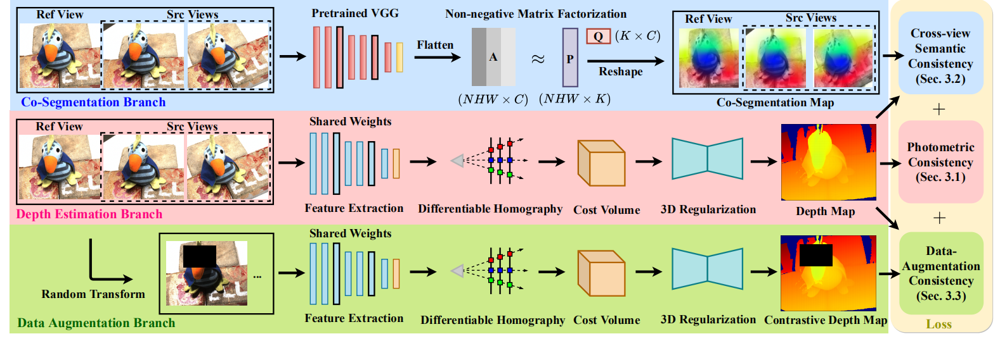

# Self-Supervised-MVS
This repository is the official PyTorch implementation of our AAAI 2021 paper:

"*Self-supervised Multi-view Stereo via Effective Co-Segmentation and Data-Augmentation*"

Code will be released soon!

## Introduction

This project is inspired by many previous MVS works, such as [MVSNet](https://github.com/xy-guo/MVSNet_pytorch) and [CVP-MVSNet](https://github.com/JiayuYANG/CVP-MVSNet). Whereas the requirement of large-scale ground truth data limits the development of these learning-based MVS works. Hence, our model focuses on an **unsupervised setting** based on self-supervised photometric consistency loss. 

However, existing unsupervised methods rely on the assumption that the corresponding points among different views share the same color, which may not always be true in practice. This may lead to unreliable self-supervised signal and harm the final reconstruction performance. We call this problem as **color constancy ambiguity problem**, as shown in the following figure:

To address the issue, we propose a novel self-supervised MVS framework integrated with more reliable supervision guided by semantic co-segmentation and data-augmentation. Specially, we excavate mutual semantic from multi-view images to guide the semantic consistency. And we devise effective data-augmentation mechanism which ensures the transformation robustness by treating the prediction of regular samples as pseudo ground truth to regularize the prediction of augmented samples. The brief illustration of our proposed framework is shown in the following figure:

## Acknowledgement

We acknowledge the following repositories [MVSNet](https://github.com/YoYo000/MVSNet) and [MVSNet_pytorch](https://github.com/xy-guo/MVSNet_pytorch). Furthermore, the baseline of our self-supervised MVS method is partly based on the [Unsup_MVS](https://github.com/tejaskhot/unsup_mvs). We also thank the authors of [M3VSNet](https://github.com/whubaichuan/M3VSNet) for the constructive advices in experiments.